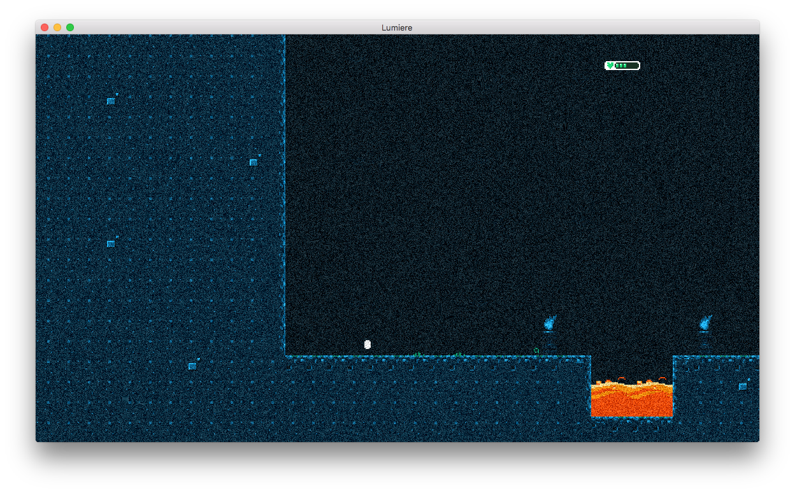

# Grain
Adds random grain/noise

## Before

## After

# Usage
You can use the effect as is or create a grain instance where the grain strength is configurable:

	local posteffects = require "lumiere.effects.posteffects"
	local grain = require "lumiere.effects.grain.grain"

	-- use grain with default settings (grain strength = 32)
	local grain_effect = posteffects.create(grain)

	-- use grain with custom settings (grain strength = 40)
	local custom_grain = blur.create(40)
	local grain_effect = posteffects.create(custom_grain)

	-- strength can also be changed afterwards
	custom_grain.strength = 4
