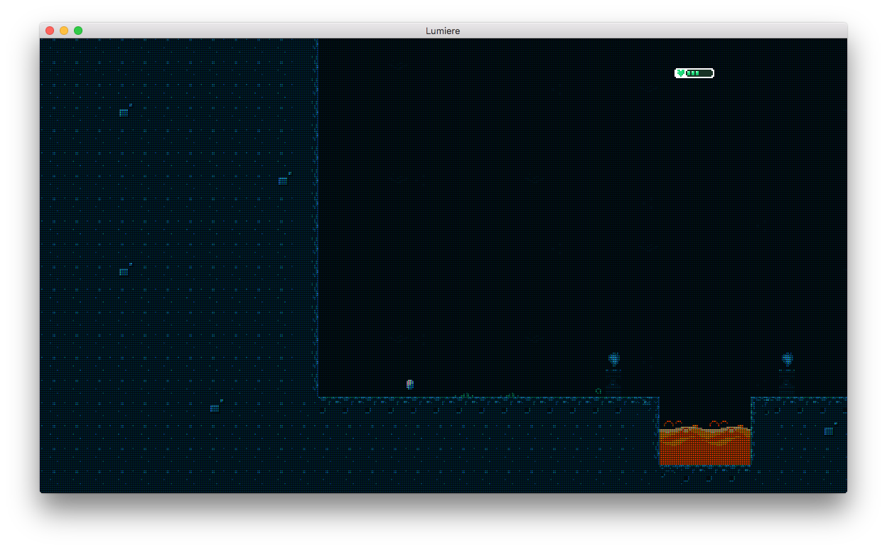

# LCD
Adds an LCD matrix overlay

## Before

## After

# Usage
You use the effect as is by adding it to a posteffect sequence:

	local posteffects = require "lumiere.effects.posteffects"
	local lcd = require "lumiere.effects.lcd.lcd"

	-- use lcd with default settings
	local lcd_effect = posteffects.create(lcd)
