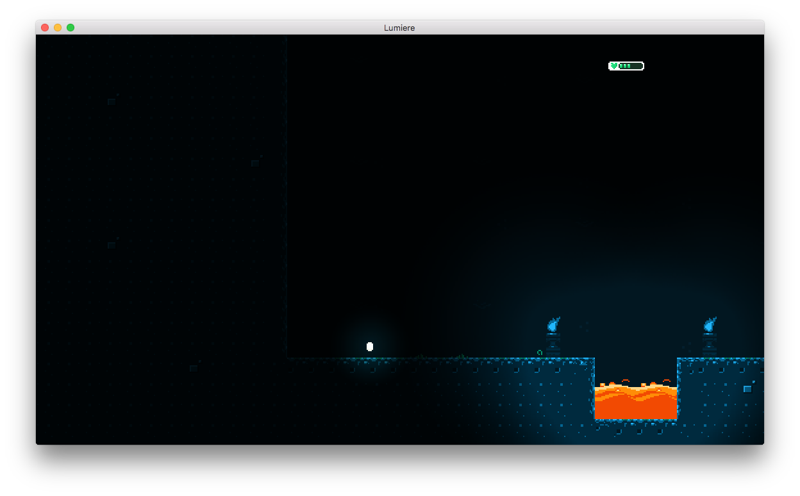

# Lights
Adds simple 2D lightsources and ambient light

## Before

## After

# Usage
You can use the effect as is or create a lights instance where the ambient light and light intensity is configurable:

	local posteffects = require "lumiere.effects.posteffects"
	local lights = require "lumiere.effects.lights.lights"

	-- use lights with default settings
	local lights_effect = posteffects.create(lights)

	-- use lights with custom settings
	local ambient_light = vmath.vector4(0.2, 0.2, 0.4, 1.0)
	local min_intensity = 0.6
	local max_intensity = 0.7
	local lights_instance = lights.create(ambient_light, min_intensity, max_intensity)
	local lights_effect = posteffects.create(lights_instance)

	-- update ambient light and intensity afterwards
	lights_instance.ambient_light = vmath.vector4(0.6, 0.6, 0.6, 1.0)
	lights_instance.min_intensity = 0.9
	lights_instance.max_intensity = 1.0

This will if nothing else is changed result in ambient light being applied to the scene. To also have certain areas of the scene act as lightsources you also need to render lights in a separate pass. Assign the `lightsource.material` to anything that is supposed to act as a lightsource.
