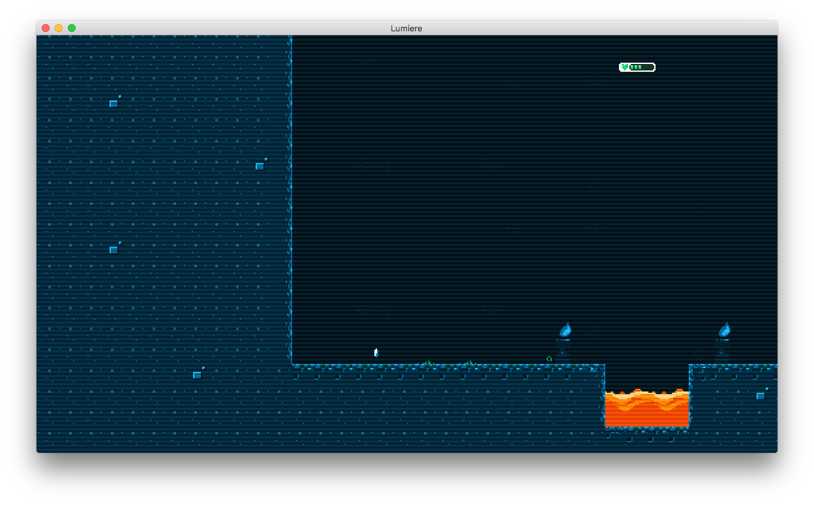

# Scanlines
Adds a TV interlace effect

## Before

## After

# Usage
You use the effect as is by adding it to a posteffect sequence:

	local posteffects = require "lumiere.effects.posteffects"
	local scanlines = require "lumiere.effects.scanlines.scanlines"

	-- use scanlines with default settings
	local scanlines_effect = posteffects.create(scanlines)
